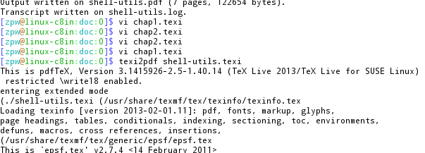

Overview of Shell-Utils
***********************

Introduction
============

Shell-Utils is a bunch of useful shell scripts as well as some scripts or binary in other languages.

Reporting Bugs
==============

We welcome bug reports and suggestions for any aspect of the Shell-Utils:  programs,
documentation, installation, etc.  Please email them to yunxinyi@gmail.com.
Or you could open an issue at https://github.com/oxnz/shell-utils/issues.
You can get the latest version of Shell-Utils via its home page,
https://github.com/oxnz/shell-utils.

Install
=======

* automatically

Open your favorite terminal and type:

.. code-block:: sh

    curl -L 'https://raw.githubusercontent.com/oxnz/shell-utils/master/tool/install' | sh

or

.. code-block:: sh

    wget 'https://raw.githubusercontent.com/oxnz/shell-utils/master/tool/install' -O - | sh

and this will append the source command in your ``~/.bashrc`` and ``~/.zshrc``.

To specify another directory instead of the default ``~/.shell-utils``, you need to define the ``DESTDIR`` variable like this:

.. code-block:: sh

    wget 'https://raw.githubusercontent.com/oxnz/shell-utils/master/tool/install' -O - |
    DESTDIR=/path/to/install sh

* manually

    * Clone the repository

.. code-block:: sh

    git clone 'https://github.com/oxnz/shell-utils.git' ~/.shell-utils

..

    * Create soft link to the rc files you want to use

.. code-block:: sh

    ln -s ~/.shell-utils/rc/bashrc ~/.bashrc
    ln -s ~/.shell-utils/rc/zshrc ~/.zshrc

Using Shell-Utils
=================

Already installed? just open a new terminal and try out the amazing stuff.

Update
======

There's two strategies for update:

* using ``git(1)``

.. code-block:: sh

    git pull

* using ``skel(1)``

.. code-block:: sh

    skel update
    # use the following line to turn on auto update
    # skel set autoupdate true

Customize
=========

If you want to override any of the default behaviors, just add your sutff in the ``custom`` directory.

Contribution
============

If you have ideas on how to make the project better, don't hesitate to fork and send pull requests!
